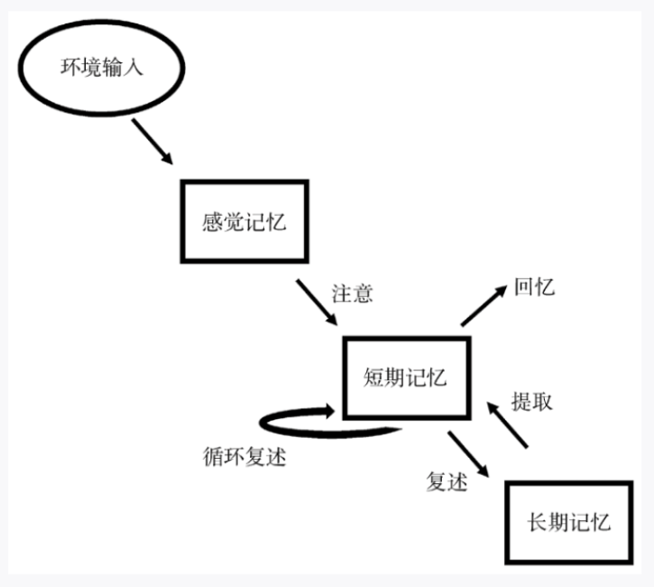

## 2026.3.17

## 2026.3.18

大脑的不同部分对应着不同的功能，例如一些部分对应着身体的运动，一些部分对应着思维语言等等。

大脑随时随地都在变化，即使是看到了这句话。你的大脑已经发生了改变。从微观角度上说，心理学就是信息在神经元之间传递所反映的。但研究心理学可以不研究神经科学。就像写程序不用研究电脑是由什么做的一样。

神经科学的研究有助于研究心理学。

没有意识也可以进行智力活动，就像真菌可以找出迷宫的最短路径一样。真菌没有意识而拥有智力，可以快速找到最短路径

人无法真正的了解一个人，因为你无法完全了解他内心的想法意识，你只能通过不断的加深了解进行推测！！

意识是有局限性的。就例如人不可能同时专注于两件事。但习惯可能是无意识的，例如走路时听歌，走路是无意识的，听得歌曲可以是有意识的。也就是说，当我们同时在进行两件事的时候，其中至少有一件事是无意识的，不用分神。

一些好的行为应该养成习惯，不要耗费心神去想为什么要做啊，怎么做啊等等。而是到了时间自动去做，就比如锻炼，养成习惯，不要想今天练什么，而是我习惯了这么练。因为人的注意力是有限的。把一些事变成了习惯才能分出更多的精力做更多的事。

## 2026.3.19
我们的一些意识反应就是习惯，有时候不受控制，就像认字一样。下意识的就能认出来。

意识具有第一人称的特点。在我们所有的经历中，我们都是绝对的处于中心。大部分时候我们以为受到了别人的关注，其实并没有。不要多想。

如何压制自我意识呢，一种方法是处于人群中。另一种方法是生物学上压制神经元受体，例如喝酒。

我们无法意识到全部的事物。一种说法是现在的系统只能处理这么多。另一种弗洛伊德认为人会将一些信息藏在自我意识之下，处于对自我的保护。有意识的行为活动会从人的表现上看出来，只有让自己无意识的行动，其他人才看不出来。

意识有时是一种好事，有时是一种负担。

弗洛伊德的理论认为，生活中一些口误，失误，下意识的行为暴露了自己内心最深处的想法（可能是一些极力否认的）。

弗洛伊德认为人的心智由本我，自我，超我构成。本我是内心最原始的欲望。超我拥有者道德，良知。而自我夹在这两者中间。发展顺序是，先拥有本我，然后自我，最后超我。

弗洛伊德的理论现在不在研究是因为其存在的模糊性以及不可证伪性。（换句话来说就是无敌人，咋地都能解释的通）

## 2026.3.20
行为主义者都主张这三个观点1.人之间是没有差异的，都由外部环境所塑造。2.物种之间也没什么有趣的差别。3.反心理主义：从根本上否定意识或内在心理过程作为科学研究对象

行为主义是关于刺激-反应的。
## 2026.3.22
经典条件反射是联结，将A和B通过训练联结起来，被动的对已知刺激做出反应。刺激先于反应。
操作性条件反射是通过强化的方式（通过与预期结果相比给奖励或者惩罚）让生物进行预期活动，主动作用于环境（更加适应环境）。反应先于刺激。

中性强化刺激通过训练可以与非条件强化刺激联结，变成积极强化刺激或消极强化刺激。

部分强化效应指的是在整个过程中对于行为偶尔的进行奖励或惩罚，行为会一直继续下去。可能会更久。

与弗洛伊德理论过于包罗万象模糊相比，斯金纳的理论过于单薄，无法解释人类心理的丰富性。

**心理小记：我们躺着刷短视频，不断的往下滑想刷新到自己想看的小视频，过程中有许多并不喜欢看的视频，但因为多次刷新能刷到自己想看的令自己愉悦的那条，就会不断的刷新。这就是操作性条件反射啊。我们在此时就像行为主义者的笼子里的老鼠。**

## 2026.3.24
知识从何而来？
知识是由先天（基因）和后天（学习）共同作用而得到。二者共同构建了知识。就像先天构建了组织框架，通过在框架内后天学习获得了知识。

作为成年人，我们所知道的一切有多少是先天的，有多少是后天习得的?

一般而言，儿童的心理与成人的心理有何不同?

发展心理学家皮亚杰认为心理活动包含复杂的认知结构。称为图式。图式通过两种方法来运作，第一种是同化，通过已有的图式来处理没有遇见过的状况。比如婴儿先天可以吮吸母乳。婴儿吮吸自己脚趾或小玩具是图式同化的方式。第二种是顺应。即改变现有图式或产生新的图式来适应新的信息和经验。

皮亚杰对儿童发展的表述具有三个局限性。1.理论上有局限性。没有解释改变和重构是如何在神经系统层面上发挥作用的。2.方法论上有局限性。3.为了得出结论有些太急了。忽略了其他可能情况。（这不是也属于方法论吗）

## 2026.3.26
现代心理学最伟大的发现之一：儿童对物理世界有先天的理解

人类群体本质化就是指的是人们倾向于认为，某个特定的人类群体共享着一种深层的天生的，不可改变的本质。而这种隐藏的本质决定了该群体所有成员的外貌，性格，智力，行为方式。这种想法是不健康的。最容易带来偏见。拥有几个核心特征。1.属于哪个群体就具有该群体的特征，不可改变。例如，某个民族骨子里就是懒惰，软弱的。2.认为群体内部千人一面。都一样。例如你是四川省的人，一定吃辣吧。3.认为群体之间的界限是绝对的。例如有的种族之间具有绝对的鸿沟。

## 2026.3.29
语言是行为所在。所以现代所有成功的心理学研究都离不开语言是如何学习和使用的。

本书主要是研究自然语言（与计算机语言，肢体语言，甚至路片交通牌子上那种语言不通。是汉语，英语，阿拉伯语这种意义上的语言。）

我们会发现一个神奇的事，就是每种语言都能描绘出一副相同的场景。即使那个场景被用其他语言描述出来， 你看到的也只是一段文字，但你仍能用另一种语言描述出来。这是计算机语言等所不具有的能力。

语言使我们天性的一部分。就像鸟会叫，蜜蜂会嗡嗡。是一种信息交流系统。经过漫长物种变异环境适应，形成了语言这种交流系统。

音韵学是与语言在物理直接实现的相关分支。音素是组成发音的部分。例如我国的拼音，国外的音标。

形态学指的这个字是怎么构成的。例如“好”字是几个笔画连在一起构成了一个汉字。词素指的是组成字的最小有意义的单位。例如木，林，森。木是最小的词素。

## 2026.3.30
语言是有规则和联想的。例如给出三个词。我，狗，踢 。看到这三个词一般情况下脑子就会自动组合成我踢狗。这是联想。规则在法律中显现：什么是父亲，什么是汽车，什么是键盘。在游戏中显现：马走日，篮球的三分和两分。规则和联想是同时存在于我们的大脑。

其他生物没有人类一样的语言系统。即使是最接近人类的狗，也只会是对单词产生刺激。比如棒球，狗会去做捡球的行为。而人类小孩会知道棒球是一个指代某种事物的符号，会要棒球，打棒球，也会知道那里没棒球。

小孩子从娘胎里就能分辨出语言和声音的能力。婴儿们也更喜欢出生前所听到的语种的语言。婴儿们6个月开始能分辨出单词的涵义。1岁可以说话。说的单词与成长的环境有关。

孩子很小就知道了句法规则，即使不完全理解所有单词的意思。学语言有一个关键期，这段时间对语言最为敏感。

斯金纳的操作性条件反射为什么解释不了孩子怎么学语言的。1.如果语言学习机制与其他学习机制相同的话。就不应该存在孤立语言障碍。当大脑受伤时，会导致语言功能受损。而其他功能或多或少不受影响。无法解释这种现象。2.强化和惩罚不是必要的。一些地方对语言功能学习的强化和惩罚的程度基本没有，但孩子们还是可以说话。3.儿童学习的不是行为，而是规则。可以对陌生的句子进行理解。这不是刺激强化所能解释的。

## 2026.3.31
什么是感觉呢。我们使用我们的感觉器官接触外界的光，声波，气味，皮肤按压的感觉。这种接触使得神经元放电。这种放电产生的体验被称为感觉。
## 2026.4.3
什么事知觉呢。就是将感觉与我们大脑对世界如何运作的期待结合起来，由此产生了我们对周围世界的丰富体验，这个过程称为知觉

## 2026.4.4
真实是什么，有一种解释是这样的。真实就是即使任何即使你不再相信这件它时，它也不会消失的事
我们对刺激变化的体验是由比例决定的，并不是一个绝对的数值。
有一个这样的难题，可以扩展思考一下。我们可以看到彩虹，听到孩子笑，闻到玫瑰的香味。但所有这些体验都已同样的神经元放电的形式进入大脑。这些信号没有什么联系显示他们属于视觉还是听觉。如果把来自眼睛的神经和属于耳朵的神经的地方进行调换。你是能听到彩虹还是看到孩子笑。

我们如何评估亮度？分为两个部分 1.视觉系统的输入：基于光照视网膜产生神经元放电反应
2.你对世界的假设。一部分来自于视觉系统本身的部分；一部分来源于你的期待和记忆。

知觉并不是被动地接收光线，而是大脑在不断地**预测**。如果外部输入符合你的假设，你就“看”到了物体；如果输入与假设不符（比如看错人），大脑会迅速修正假设。

来自外界自下而上输出的信息是混乱且不完整的，而大脑会努力的不断去整合他。

## 2026.4.5
当自下而上的信息（外界接收的信号）与自上而下的信息（脑子里对此的期待）发生冲突时。最终自下而上的信息会获胜。

记忆是怎么进入脑子的。由以下过程决定。首先从感觉器官放电。就到了感觉记忆。就类似于你走神听别人说话，别人突然问你刚才说了什么，你能说出来一两个词。感觉记忆通过注意的方式形成了短期记忆。短期记忆类似于世界与心理交互的平台，可以接受来自注意和长期记忆的信息输入。

但短期记忆容量有限。长期记忆的容量目前可以近似看成无限的。

我们如何将信息存入长期记忆的。通常来说学习是无意识和自动的。各种各样的经历毫不费力的进入大脑。可是有一些内容不会被自动记忆，怎么办才好呢。一个方法是利用加工深度：你对某件事思考的越深，试图赋予的意义越多，越容易记住。 第二种方法是让经历更生动更形象、例如学习海马体是什么。一种是海马体参与空间环境的记忆。另一种是海马体帮助你在校园里找到方向。

## 2026.4.6
有很多经历没有被存储起来，所以你无法回忆起那一份记忆。 也有可能记忆短暂的存储起来，但会被遗忘。

记忆可能通过我们不知道的因素扭曲和改造进而产生虚假记忆。
## 2026.4.7
记忆可能通过引导式提问产生虚假记忆，所以在现代法律的框架下禁止诱导式提问。

## 2026.4.9
为什么有时候我们会通过非理性行为犯错呢？
1我们可能在重要的方面表现出非理性 
2这种非理性行为更可能发生在非自然条件下，我们的大脑尚未进化到能够处理这种情况 
3.即使在这种情况下，我们也有潜力做的更好

政治似乎是我们最受易受到非理性想法影响的区域

人们更倾向于自己信任的想法，立场，并进行维护。 并且我们倾向于更多的与自己看法相同的人联系。

有一些非理性思想超越了现实，其实无伤大雅，因为不会对个人生活造成什么的影响，还可能带来娱乐、启发、或道德上的教义。不必争论！！！

书中的理性指的是正确使用知识和逻辑来实现你的目标。注意，是为了实现目标而做的选择。是一种工具理性。至于目标的建立的过程是否理性，不属于这个评判范畴。

## 2026.4.13
我们总是固执的认为我们是对的，思想的外边建造着军事堡垒以保护我们的思想。信念是根深蒂固的，除非有什么不容忽视的事实，我们可能退让这一片根据地，其他时候我们会固收我们的城池，不断寻找证据理由来支持巩固我们的信念思想。随着时间的流逝，我们的信念得到了增援武装强化。更加固收我们的城池。

当你可以轻易的解释任何事情时，你根本就不是在解释事情。怎么理解，这意味着无论出现什么情况、什么证据、什么反例，这个解释都能“套用"上去，而且毫不费力。比如:。有人说:"他考试成功是因为努力了。"
你反问:“"那如果失败了呢?"
回答:"那是因为还不够努力。"
一"努力程度"这个解释，既能解释成功也能解释失败，永远正确。
真正的解释，必须能够排除某些可能性，或者说，必须承担被反例推翻的风险。如果一个解释能包容一切(包括矛盾的情况)，那么它就失去了预测能力和信息量。它只是给所有现象贴上了同一个标签，没有告诉我们任何具体的因果机制或条件。
**好的解释是“脆弱的”**——它有可能被事实推翻，因此它才真正提供了关于世界的具体信息。如果你发现自己的解释永远不会错、永远能自圆其说，那恰恰说明你根本没有在解释，只是在用语言编织一个无法被检验的信念网络

## 2026.4.19
本能是什么，本能就是在没有预见的结果，没有预先训练的情况下，以某种方式行为去达到某些目标的能力。

并非所有有益的特质都是适应性进化出来的。有些特质对我们的生活是非常有益的，但却不是为了这个目标而”进化“出来的。分为三种情况
1.副产品。比如血是红色的。血的功能是为了运输氧气。红色这个特征本身并没有进化上的益处。但医生可以通过血色来判断健康。
2.前适应。某种特征最初是为了解决问题 A 而进化的，但后来被“挪作他用”去解决问题 B，且在 B 方面表现得非常有益。鸟类的羽毛。最初进化出来可能是为了**保暖**（适应性），但后来在飞行中发挥了巨大作用（有益）。在它刚开始用于飞行时，飞行的功能被称为“外适宜”而非最初的“适应”。
3.文化与环境的“巧合。在现代心理系统中，这一点尤为明显。很多对现代人极其有益的特质，在基因层面并没有对应的“进化设计”。阅读和写作。 阅读对现代人极其有益，但人类并没有所谓的“阅读基因”。大脑中处理文字的区域，原本是进化用来识别物体和纹理的。我们只是利用了大脑的**可塑性**，将旧有的生物系统套用在了现代文化工具上。

从进化角度上考虑心理学是一个重要的部分。但将进化学和心理学联系在一起时，往往有以下两个误会。
1.会混淆进化的动机和心理的动机。我们人吃东西是为了能量，活着。但人在吃饭的时候不会说为什么吃饭，他吃东西回想着是因为食物好吃，想吃更多。从进化的角度看，我们爱孩子是因为自然选择而非道德，其原因在某种意义上是自私的。但父母照顾孩子可不是出于自私的动机。
2.误解认为进化上的目标是价值目标，我们应该这样做。如果相信对一个人而言最重要的是传播自己的基因。那么秘密用自己的精子让那些想与丈夫生孩子的女士怀孕的一生能过上最好的生活。

## 2026.4.22
	人类行为的动机的来源是什么？     答案：来自本能和情绪
	人类为什么会有动机呢？首先有三种解释。(1)细胞会使自己维持在一个稳定的环境中（2）大脑会预期自己这样做，使得预测误差最小（3）避免痛苦/追求快乐。
	这三个理论是不可证伪的，所以没什么意义。比如你为什么想喝水。你大脑预测了自己要拿起来水杯喝水。然后你为了使预测误差最小，执行了这个动作。 你为什么不想喝水，因为你没有预测自己拿杯子，所以不会行动。这明显正反都能说。其他俩理论也是。
	接着有一个观点，我们有许多动机，有一些和其他生物相同。有一些是为了个人利益（性），有一些是为了他人（道德）。本能是什么，本能是生物在不知道结果，没有预先训练的情况下，按照某种方式去达到特定目的的能力。例如人被吓，第一时间反应是向后撤。这时候的动机来自己本能
	这些本能的起源可以从进化学上理解。他们的存在是通过进化的过程塑造的，如记忆、感知、学习和推理。生物会发生基因遗传和变异，一些有益变异的基因会通过遗传保留下来，不适合当时环境的基因会被自然选择淘汰。例如动物碰见捕食者就会跑（刚开始有跑的有不跑的，不跑的都死了）。从自然选择的角度看，所有的生物都想把自己的基因遗传下去并存在。
	另一种是情绪。没有情绪的个体是无法追求个体的目标，也就是不存在动机了。有两个人头部情绪区受损。他们通常分辨不出事物哪个优先级高，表现为不知道要去做什么。情绪有许多种，包括了恐惧、悲伤、惊讶、厌恶、高兴等。恐惧在一定程度上是保护了自己，可以激发自己的肾上腺素等。厌恶是避免接触对自己有害的东西。开心是想接触自己喜欢的东西。
	但现代心理学补充了两点，认知和环境。认知就是我们会因为思考而行动。比如老师让我搬电脑屏幕，